<div align="center">


<br />

<a href="https://www.linkedin.com/in/burak-han-ulusoy-21378126b">
  
</a>
<a href="mailto:burakhanulusoy18@gmail.com">
  
</a>
<a href="https://www.kaggle.com/burakhanulusoy">
  
</a>

</div>

<br />

## `~/developer-profile`

```yaml
name: Burak Han Ulusoy
role: .NET Backend Developer
education: Computer Engineering

focus:
  - AI-integrated backend systems
  - Data-intensive applications
  - Scalable REST APIs
  - Real-time communication

engineering:
  - Clean and layered architecture
  - Performance-oriented data access
  - Secure authentication and authorization
  - Maintainable, testable application design
```

## `~/tech-stack`

<table>
  <tr>
    <td align="center" width="210"><strong>LANGUAGES & CORE</strong></td>
    <td>
      
    </td>
  </tr>
  <tr>
    <td align="center"><strong>BACKEND</strong></td>
    <td>
      
      
      
      
      
      
    </td>
  </tr>
  <tr>
    <td align="center"><strong>ARCHITECTURE</strong></td>
    <td>
      
      
      
      
      
      
      
      
    </td>
  </tr>
  <tr>
    <td align="center"><strong>DATA</strong></td>
    <td>
      
      
      
      
      
      
    </td>
  </tr>
  <tr>
    <td align="center"><strong>AI & ML</strong></td>
    <td>
      
      
      
      
      
      
    </td>
  </tr>
  <tr>
    <td align="center"><strong>FRONTEND & VISUALS</strong></td>
    <td>
      
      
      
      
    </td>
  </tr>
  <tr>
    <td align="center"><strong>TOOLS & DEVOPS</strong></td>
    <td>
      
      
      
    </td>
  </tr>
</table>

## `~/engineering-focus`

<div align="center">


</div>

## `~/github-telemetry`

<div align="center">


<br />


<br />

<picture>
  <source media="(prefers-color-scheme: dark)" srcset="https://raw.githubusercontent.com/burakhanulusoy/burakhanulusoy/output/github-contribution-grid-snake-dark.svg" />
  <source media="(prefers-color-scheme: light)" srcset="https://raw.githubusercontent.com/burakhanulusoy/burakhanulusoy/output/github-contribution-grid-snake.svg" />
  
</picture>

</div>

---

<div align="center">

```text
available_for = ["collaboration", "internship", "backend projects", "AI integrations"]
```

<sub>Built with curiosity, clean architecture and a lot of coffee.</sub>

</div>
