<div align="center">



<br />

<a href="https://www.linkedin.com/in/burak-han-ulusoy-21378126b">
  
</a>
<a href="mailto:burakhanulusoy18@gmail.com">
  
</a>

</div>

## `~/developer-profile`

```yaml
name: Burak Han Ulusoy
role: .NET Backend Developer
education: Computer Engineering

specialization:
  - ASP.NET Core Web API development
  - Clean and layered application architecture
  - CQRS and MediatR-based backend systems
  - High-performance data access
  - AI and third-party service integrations
  - Real-time web applications
```

## `~/technical-capabilities`

<table>
  <tr>
    <td align="center" width="220"><strong>.NET & BACKEND</strong></td>
    <td>
      
      
      
      
      
      
      
      
      
    </td>
  </tr>
  <tr>
    <td align="center"><strong>ARCHITECTURE</strong></td>
    <td>
      
      
      
      
      
      
    </td>
  </tr>
  <tr>
    <td align="center"><strong>PATTERNS</strong></td>
    <td>
      
      
      
      
      
    </td>
  </tr>
  <tr>
    <td align="center"><strong>DATA</strong></td>
    <td>
      
      
      
      
      
      
      
      
    </td>
  </tr>
  <tr>
    <td align="center"><strong>AI & ML</strong></td>
    <td>
      
      
      
      
      
      
      
    </td>
  </tr>
  <tr>
    <td align="center"><strong>APPLICATION</strong></td>
    <td>
      
      
      
      
      
      
      
    </td>
  </tr>
  <tr>
    <td align="center"><strong>FRONTEND</strong></td>
    <td>
      
      
      
      
      
      
      
      
    </td>
  </tr>
  <tr>
    <td align="center"><strong>TOOLS & DEVOPS</strong></td>
    <td>
      
      
      
      
      
      
    </td>
  </tr>
</table>

## `~/engineering-focus`

<div align="center">


</div>

## `~/github-telemetry`

<div align="center">


<picture>
  <source media="(prefers-color-scheme: dark)" srcset="https://raw.githubusercontent.com/burakhanulusoy/burakhanulusoy/output/github-contribution-grid-snake-dark.svg" />
  <source media="(prefers-color-scheme: light)" srcset="https://raw.githubusercontent.com/burakhanulusoy/burakhanulusoy/output/github-contribution-grid-snake.svg" />
  
</picture>

</div>

---

<div align="center">

Open to **internships**, **.NET backend projects** and **AI-focused collaborations**.

[LinkedIn](https://www.linkedin.com/in/burak-han-ulusoy-21378126b)
·
[Email](mailto:burakhanulusoy18@gmail.com)

</div>
